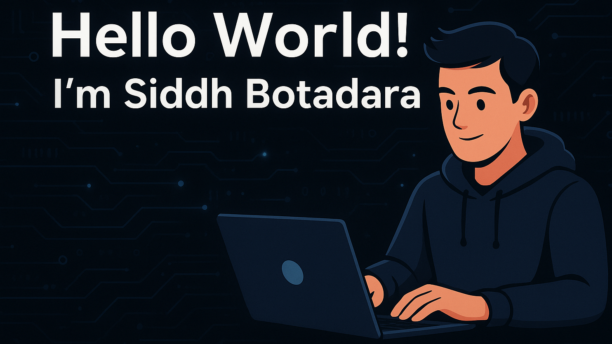

  

  

## 🌟 About Me  

  

  
   
  
   
  
   
  

- 🔭 I’m currently working on **IoT + Full Stack Projects**  
- 🌱 I’m exploring **other web technologies and AI & Machine Learning**
- 💬 Ask me about **Web Dev, APIs, or Java**  
- 👯 I’m looking to collaborate on **Web Development and Game Development projects**  
- ⚡ Fun fact: **I love creating unique and creative projects that no one has ever done before.**

 

## 💻 My Tech Stack

  

 

<b>🟢 Languages:</b> 

 

<b>🎨 Front-End:</b> 

 

<b>⚙️ Back-End / Frameworks:</b> 

 

<b>💾 Databases:</b> 

 

<b>☁️ Deployment & Cloud:</b> 

 

<b>🛠️ Dev Tools & Libraries:</b> 

 

<b>🤖 Hardware & Microcontroller:</b> 

 

<b>🖌️ Design / CAD:</b> 

 

<b>📦 Installers / Packaging:</b> 

 

## 🚀 GitHub Stats  

  

  

    
    
  

 

## 📈 Contribution Snake  

  

 

## 🏆 GitHub Trophies

  

 

## ✍️ Quote

  

  

 

### 📫 Connect with me  

  

  
  

  

