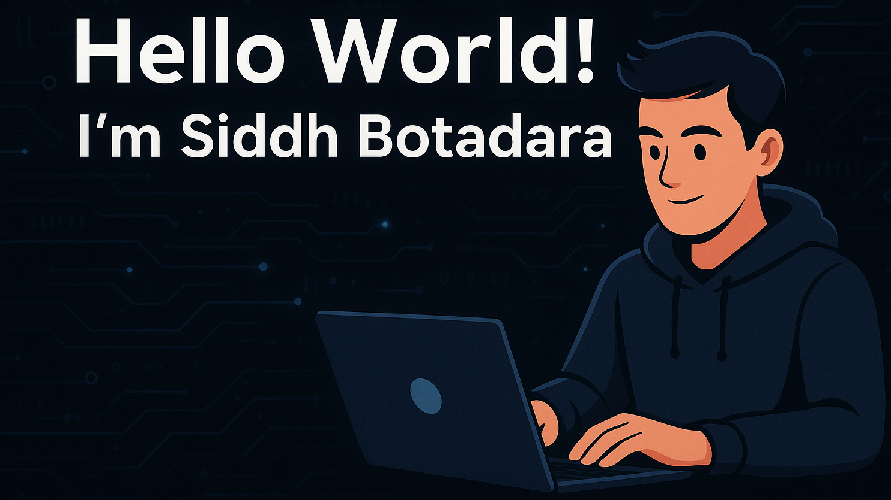

  

  

## 🌟 About Me  

  

  
   
  
   
  
   
  

- 🔭 Currently building **AI-powered full-stack systems and real-time distributed applications**
- ⚙️ Working with **React, Node.js, Django, PostgreSQL, and scalable backend architectures**
- 💬 Ask me about **system design, APIs, backend engineering, or AI pipelines**
- 🤝 Open to collaborating on **high-impact full-stack, AI, or system-level projects**
- ⚡ Fun fact: **I enjoy engineering systems that combine software, hardware, and real-world data**

 

## 💻 My Tech Stack

<b style="font-size:22px">Core</b> 

  
  Python

  
  Java

  
  JavaScript

 

<b style="font-size:22px">Frontend</b> 

  
  React

  
  Tailwind CSS

  
  HTML

  
  CSS

 

<b style="font-size:22px">Backend</b> 

  
  Node.js

  
  Django

  
  Fastify

  
  REST APIs

 

<b style="font-size:22px">Database</b> 

  
  PostgreSQL

  
  MongoDB

  
  MySQL

  
  Redis

  
  Supabase

 

<b style="font-size:22px">AI</b> 

  
  Google Gemini

  
  Scikit-learn

  
  Pygame

 

<b style="font-size:22px">Cloud & DevOps</b> 

  
  AWS

  
  Docker

  
  Kubernetes

  
  CI/CD

 

<b style="font-size:22px">Tools</b> 

  
  Git

  
  GitHub

  
  Vercel

  
  Render

  
  VS Code

  
  Arduino

 

## 🚀 GitHub Stats  

  

  

    
    
  

 

## 📈 Contribution Snake  

  

 

## 🏆 GitHub Trophies

  

 

## ✍️ Quote

  

  

 

## 📫 Connect with me  

  

  
  

  

